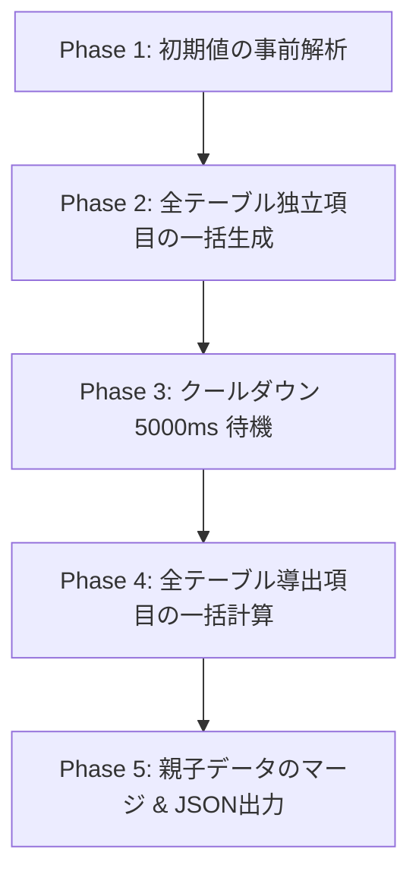

# DB Architect (Schema Designer)

ブラウザ上で動作するスキーマ設計・データベース設計ツールです。
React + Vite + Tailwind CSS を使用して構築されており、最終的に「1つのHTMLファイル」として出力できる構成になっています。

## ディレクトリ構成

```text
/
├── index.html          # 開発時用のエントリポイント（直接ブラウザで開かないこと）
├── package.json        # パッケージ管理とスクリプト
├── vite.config.js      # Viteと単一ファイル出力（vite-plugin-singlefile）の設定
├── src/
│   ├── main.tsx        # Reactのマウント処理と依存関係注入
│   ├── index.css       # ベーススタイル
│   ├── constants/      # 初期データや定数
│   ├── domain/         # ドメイン層（ビジネスルール）
│   │   ├── models/     # ドメインモデル（Table, Relationship, ValueObject などの型定義・バレル）
│   │   └── services/   # ドメインサービス（状態を持たない純粋ビジネスロジック）
│   ├── ports/          # ポート（境界インターフェース定義）
│   │   ├── inbound/    # インバウンドポート（ユースケース定義）
│   │   └── outbound/   # アウトバウンドポート（永続化やAIクライアントなどの抽象化）
│   ├── application/    # アプリケーション層（ユースケースの実現）
│   │   └── services/   # アプリケーションサービス
│   ├── adapters/       # アダプター（具象実装）
│   │   ├── inbound/    # インバウンドアダプター
│   │   │   └── react-ui/ # Reactベースのユーザーインターフェース（App.tsx, components/）
│   │   └── outbound/   # アウトバウンドアダプター（LocalStorage, FileExporter, Gemini API クライアント）
│   ├── hooks/          # Reactの状態（State）の同期を行うための薄いカスタムHook
│   └── utils/          # 汎用ユーティリティ
├── data/
│   ├── AIサンプルデータ生成の指示.txt
│   └── 家計管理システム/ # 家計管理システム用データ (spec.md)
├── models/
│   └── tutorial/       # チュートリアル・サンプル用のモデルデータ (spec.md)
└── dist/
    └── index.html      # 本番用（ビルド後）の成果物。ダブルクリックで動く単一ファイル
```

## 開発の始め方

初めて開発を行う際、またはリポジトリをクローンした直後は、以下のコマンドで依存パッケージをインストールしてください。

```bash
npm install
```

## スクリプトの使い方

### 1. 開発サーバーの起動 (Development)

コードを編集してプレビューを確認したい場合は、以下のコマンドを実行します。

```bash
npm run dev
```

実行後、ターミナルに表示されるローカルURL（例: `http://localhost:5173`）にブラウザでアクセスしてください。
ソースコードを保存すると、即座にブラウザに変更が反映されます（Hot Module Replacement）。

**⚠️ 注意事項:**
ルートディレクトリ直下にある `index.html` をエクスプローラーからダブルクリックで開いても、ブラウザのセキュリティ制限（CORS）により動作しません。必ず `npm run dev` 経由で確認してください。

### 2. 本番用ファイルのビルド (Production Build)

開発が完了し、単独で動くHTMLファイルを作成したい場合は、以下のコマンドを実行します。

```bash
npm run build
```

コマンドが完了すると、`dist` フォルダの中に `index.html` が生成されます。

**💡 成果物について:**
`vite-plugin-singlefile` の機能により、CSSやJavaScriptのコードはすべてこの `dist/index.html` 1つのファイルに埋め込まれています。
ツールを使用する際や誰かに配布する際は、この `dist/index.html` を渡し、ブラウザで直接ダブルクリックして開いてください（オフラインでも動作します）。

## チュートリアルモデルについて

本プロジェクトの `models` ディレクトリには、動作確認やツールの機能を体験するためのチュートリアル用モデル（スキーマ設計データ）が格納されています。

* **家計管理システム（チュートリアル用）** ([spec.md](models/tutorial/spec.md))
  * **⚠️ 重要:** このサンプルモデルに定義されているテーブル構造やリレーション、各種設定といった**モデルのインスタンスは、生成AIによって自動生成されたもの**です。

### チュートリアルモデルの読み込み方法

1. 本ツールを起動します（開発サーバー `npm run dev` を起動するか、ビルド済みの `dist/index.html` をブラウザで開きます）。
2. 画面上のインポートボタン（ファイル選択）から `models/tutorial/spec.md` を選択して読み込んでください。
3. 読み込みが完了すると、家計管理システム用のテーブル構成（ユーザー、カテゴリ、収入、支出など）やリレーションが可視化され、ツールの操作感を試すことができます。

## GitHub Spec Kit との連携

本ツールは、仕様書を「唯一の真実 (Single Source of Truth)」としてAIエージェントにコードを自動実装させる仕様駆動開発 (SDD: Spec-Driven Development) ツール **GitHub Spec Kit** と連携して動作するように設計されています。  
[※具体例はこちら](https://github.com/yokota101010/NestLedger)

### 連携開発ワークフロー

1. **データモデル設計と妥当性検証**:
   本ツール上でドメイン集約、値オブジェクト、テーブルスキーマを直感的にモデリングします。その後、Gemini APIを介してAIサンプルデータを一括生成し、モデルの整合性やビジネスルールが正しく機能するかを本ツール上で**開発前に検証**（シフトレフト検証）します。
2. **Markdown仕様書のエクスポート**:
   検証完了後、ヘッダーの「仕様書保存 (.md)」ボタン（または `Ctrl + S`）を押すと、標準的な Markdown ファイル（**`spec.md`**）がエクスポートされます。
3. **GitHub Spec Kit への配置**:
   出力された `spec.md` を、リネームすることなく GitHub Spec Kit の仕様ディレクトリ（例: `specs/001-database-schema/spec.md`）にそのまま配置します。
4. **AIによるコードの自動開発**:
   GitHub Spec Kit側で開発AIエージェントを実行すると、AIは検証済みの `spec.md` をインプットとして忠実に読み込み、論理破綻やハルシネーションのない高品質なソースコード（スキーマ定義、API、データモデル）を実装します。

### 本ツールでの再編集性（後方互換）

エクスポートされる `spec.md` の末尾には、本ツールのキャンバス上のテーブル配置座標などのUIデータを含む完全な設計情報が **HTMLコメント（JSON形式）** として埋め込まれています。

GitHubや他のMarkdownプレビューからはこのコメント部は完全に無視され、綺麗なドキュメントとして表示されますが、本ツールの「仕様書読込 (.md)」からこのファイルを再度インポートするだけで、UI状態を100%復元して再編集することができます。

---

## 技術スタック

- **開発言語**: [TypeScript](https://www.typescriptlang.org/)
- **フレームワーク**: [React](https://react.dev/) (v18)
- **ビルドツール**: [Vite](https://vitejs.dev/)
- **スタイリング**: [Tailwind CSS](https://tailwindcss.com/) (v4)
- **アイコン**: [FontAwesome](https://fontawesome.com/) (CDN経由で読み込み)
- **プラグイン**: [vite-plugin-singlefile](https://www.npmjs.com/package/vite-plugin-singlefile) (アセットのインライン化)

## ライセンス

このプロジェクトは [MIT License](LICENSE) の下で公開されています。

---

## AIによるモックデータ生成機能の仕様

本ツールには、Gemini APIを使用して、定義したスキーマやリレーションシップに基づいてテスト用モックデータを自動生成する機能があります。AIに対するプロンプトの構成や生成プロセスは以下の設計に従っています。

### 1. 生成のプロセス (Workflow)
APIのレートリミットを回避しつつ、整合性の高いデータを生成するため、二段階の一括生成パイプラインをプログラム側で制御しています。



1. **初期値の事前解析 (Initial Value Parsing)**: ユーザーの初期値に関する自然言語の指示をAIに解析させ、初期レコードとして適用します。
2. **全テーブル独立項目の一括生成 (All Tables Generation)**: データベース全体のスキーマ、初期値、リレーションシップ情報を1つのプロンプトにまとめ、依存項目以外の生のデータを一括で生成します（1回のリクエストに集約してAPIコール回数を抑えます）。
3. **クールダウン待機とレートリミット対策**: レートリミット（429）を回避するため、リクエスト間に5000msの待機を挟み、失敗時は指数バックオフ（最大7回、初期10sから開始）で自動リトライします。
4. **全テーブル導出項目の一括計算 (All Tables Derivation)**: 1段階目の生成結果をAIに入力し、ソート順（`orderBy`）や項目間の依存関係を考慮して、導出カラム（`dependent`）の計算結果を一括で算出します。

### 2. データ生成におけるAIへの制約指示 (Execution Constraints)
AIに送信されるシステムプロンプト（[aiPromptTemplates.ts](src/utils/aiPromptTemplates.ts) に定義）には、以下の制約が組み込まれています。
* **参照整合性の厳守**: 外部キー（FK）には親テーブルに存在する主キー（PK）のみを設定させ、孤立レコードを発生させないこと。親の変更に応じて自動で増減（動的同期・クリーンアップ）させること。
* **スキーマの厳格性**: 主キーや一意キーの重複排除、および指定されたデータ型（日付型は `YYYY-MM-DD` 形式など）への適合。
* **業務的リアリティ**: ランダムで無意味な文字列（`test1` や `aaa` など）を避け、実用的で自然な日本語データを生成すること。
* **自己検算の実施**: 導出項目計算時、AIに最終結果を出力する前に「Chain of Thought（計算ステップの説明）」を書かせて自己検算を実行させることで、計算の正確性を担保します。
