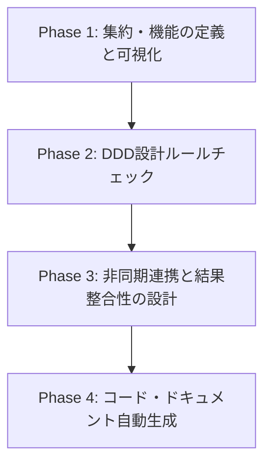

# DB Architect (Schema Designer) グランドデザイン

本ドキュメントは、本ツール（DB Architect）が単なる「物理DBスキーマ設計ツール」から、**「ドメイン駆動設計（DDD）やモデリングをサポートするアーキテクチャ設計ツール」**へと進化するための全体像とロードマップを定義したものです。

---

## 1. 背景と目的

データベースの物理設計（テーブル構造、データ型、外部キー関係）と、アプリケーションの論理設計（ビジネスドメイン、トランザクション境界、ユースケース）の間には常にギャップが存在します。

本ツールは、**「スキーマ図を描くこと」と「ドメインモデリング（DDD）を行うこと」をシームレスに融合**させ、開発者が整合性の高いソフトウェア設計を行えるように支援し、そこからクリーンな実装コードやインフラ構成へ繋げられるようにすることを目的とします。

---

## 2. コアコンセプトと設計原則

本ツールの設計における中核となる3つのコンセプトと原則です。

### ① 集約（Aggregate）: トランザクション整合性の境界
*   **概念**: トランザクション整合性を保つための最小の境界（テーブルのグループ）。
*   **役割の区別**:
    *   **集約ルート（Root）**: 集約の外部からのアクセス・トランザクションのエントリーポイントとなるメインテーブル。
    *   **集約メンバー（Member）**: 集約ルートに内包され、ライフサイクルを共にするテーブル（例: 注文に対する注文明細）。
*   **原則**: 外部のオブジェクトは、集約ルート以外のテーブル（Member）を直接参照または変更してはならない。

### ② 機能（ユースケース / バッチ / API / 画面）: トランザクションの実行単位
*   **概念**: ユーザー操作やシステムイベントによって起動される1つの処理単位。
*   **原則**: **「1トランザクション（1機能の実行）で変更（Create/Update/Delete）できるのは、最大1つの集約インスタンスのみ」**とする。
*   **紐付け**: 各「機能」に対して、変更対象となる「集約」を1対1（または1対0）でマッピングする。

### ③ ドメインイベント（Domain Events）: 結果整合性のトリガー
*   **概念**: ビジネス上重要な状態の変化（例: `OrderPlaced` - 注文確定）。
*   **発生単位**: 物理テーブルではなく、ビジネス境界である**「集約単位」**で発生・定義する。
*   **連携方式**: 集約を跨いだ状態更新が必要な場合（例: 注文完了後に在庫を減算する）、ドメインイベントを介した非同期メッセージング（RabbitMQ、Kafka等のPub/SubやTransactional Outboxパターン）を使用し、**結果整合性**を保つ。

---

## 3. ロードマップ (今後の実装フェーズ)

本グランドデザインは、以下の4つのフェーズに分けて順次実現していきます。

### 📋 Phase 1: 集約・機能の定義と可視化（第一段階）
まずは、スキーマ図の上に論理的な「集約」と「機能」の枠組みを重ね合わせます。

*   **UI（集約管理モーダル - 2つのタブ）**:
    1.  **集約構成（集約 × テーブル）**: 集約を定義し、テーブルがその集約の `Root` / `Member` / `未選択` のどれであるかをトグル選択するマトリクスUI。
    2.  **機能・集約対応（機能 × 集約）**: CRUD図で定義した「機能」の一覧を表示し、ドロップダウンメニュー（Select）から紐づける集約を1次元的（ベクトル形式）に選択・割り当てるUI。
*   **Canvas上のビジュアル可視化**:
    *   各テーブルノードの上部に、所属する集約名と役割を示すバッジ（例: `🏷️ 注文集約 (Root)`）をシンプルに表示。
    *   集約ごとに異なるカラーテーマを割り当て、バッジおよびテーブルヘッダーのボーダー（上線）に色を適用する。

---

### 🔍 Phase 2: 設計ルールチェック（DDDバリデーション）
定義された設計情報を解析し、DDDの原則に違反している箇所をツール上で自動検出します。

*   **集約間リレーション違反の警告**:
    *   ある集約から別の集約の「メンバーテーブル（Member）」に向けて直接リレーション（外部キー）が引かれている場合、Canvas上およびエディタ上で警告を表示する（集約ルートを参照するように促す）。
*   **トランザクション境界違反の警告**:
    *   CRUDマトリクスで定義されたテーブル操作（C/U/D）と、機能に割り当てられた集約を突き合わせ、1つの機能で複数の集約を変更しようとしている場合に警告を表示する。

---

### 🔄 Phase 3: 非同期連携（ドメインイベント）の設計と結果整合性の可視化
集約を跨ぐ処理の「結果整合性」を設計し、可視化します。

*   **ドメインイベントの定義**:
    *   各集約に対して、発生するドメインイベント（例: `OrderPlaced`, `InventoryReserved`）とその詳細を定義できるようにする。
*   **Pub/Sub連携の可視化**:
    *   Canvas上で、ある集約から別の集約へ「点線矢印（イベント送信ライン）」を引き、どのイベントを介して結果整合性を担保するかをグラフィカルに描画する。

---

### 💻 Phase 4: コード・インフラドキュメント自動生成
設計したドメインモデル（集約、イベント）を、実際の実装コードに変換します。

*   **DDDスケルトンコード生成**:
    *   各言語（Java, Go, TypeScript, Kotlinなど）のDDDアーキテクチャパターンに沿った、集約ルート（Entity）、値オブジェクト（Value Object）、Repositoryインターフェース、Eventパブリッシャー等のコード雛形を自動出力する。
*   **メッセージング基盤定義の出力**:
    *   RabbitMQのキュー/交換機（Exchange）定義や、Outboxパターン用のDDLなどを自動出力する。
