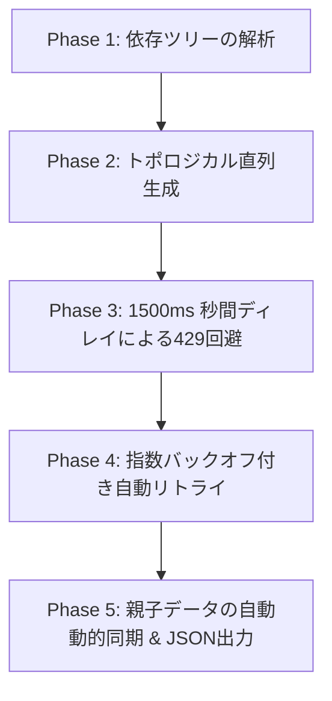

# Agent Skill: RDBインスタンスデータの標準自動生成プロトコル (RDB Instance Data Generation Protocol)

本ドキュメントは、AIエージェントがリレーショナルデータベース（RDB）のスキーマ定義に基づいて、完全に整合性が保たれた高品質なモックデータ（インスタンスデータ）を自律的に生成するための標準化された手順と規約（ベストプラクティス）を定義します。

エージェントは、データベース開発やテストデータの作成指示を受けた際、本スキルをロードし、以下のプロトコルを厳格に遵守して実行しなければなりません。

---

## 1. 前提条件と入力情報 (Inputs)

エージェントは、データ生成を開始する前に以下の情報を必ずロード・解析してください。
1. **テーブル定義 (Tables Schema)**:
   - カラム名、物理名、論理名、データ型、および「カラム説明（Description）」。
   - 制約情報：主キー（PK）、一意性制約（Unique）、非空制約（Not Null）。
2. **リレーション情報 (Relationships)**:
   - 親テーブルと子テーブルの接続関係。
   - 外部キー（FK）のマッピングルール（どのカラムが親のどのカラムを参照しているか）。
3. **導出ルール (Derived Rules)**:
   - 他のカラムや親テーブルの情報から動的に算出される導出カラムの計算式（derivation）。
4. **スキル内テンプレート定義 (`aiPromptTemplates.js`)**:
   - モックデータ生成に必要なシステムプロンプトの骨格、データ生成ルール、およびUI用ガイド定義。

---

## 2. インスタンス生成における絶対規約 (Execution Constraints)

### 規約 1: 参照整合性の100%遵守と動的同期 (Referential Integrity & Dynamic Sync)
* **実在値の参照**: 子テーブルの外部キー（FK）カラムには、親テーブルの主キー（PK）として実在する値のみを代入しなければならない。孤立レコード（Orphaned Record）の発生は一切許容されない。
* **複合キーの同期**: 複数カラムによる複合外部キー（Composite FK）が定義されている場合、その組み合わせ全体が親テーブルの複合主キーと完全に一致していなければならない。
* **動的同期（Dynamic Synchronization）**: 親テーブルのデータ（PK）に新しいキーが追加されたことを検知した場合、連動する子テーブルにも自動的にその新しいキーに紐づくレコードを新規生成し、業務的一貫性を保たなければならない。
* **動的クリーンアップ（Dynamic Cleanup）**: 親テーブルから削除されて存在しなくなったPKを参照している古い子テーブルのレコード（Orphaned Rows）は、出力結果から自動的かつ完全に削除・除外しなければならない。

### 規約 2: データ型と制約の遵守 (Strict Schema Validation)
* **一意性の確保**: 主キー（PK）や一意性制約（UQ）が設定されているカラムの値は、テーブル内で重複させてはならない。
* **データ型の適合**: 数値型、文字列型、日付・時刻型などのデータ型に厳格に適合した形式で生成すること。
  - 例：日付型は `YYYY-MM-DD` 形式を遵守する。

### 規約 3: データの一貫性と業務的リアリティ (Business Coherency & Realism)
* **無意味なデータの禁止**: `"test1"`, `"aaa"`, `"111"` のようなランダムで無意味な値は使用しない。実際の業務システムで使われるような、自然で現実的な日本語の業務データ（例: `"山田 太郎"`, `"株式会社ABC物流"`, `"090-1234-5678"`, `"東京都新宿区西新宿1-1-1"`) を使用する。
* **カラム説明との強力な紐づけ**: 各カラムに記述された「カラム説明（Description）」に特定の業務ルール（例：「食費の場合は200番台」「ステータスは『未着手』『進行中』『完了』のいずれか」など）が指定されている場合、それを最優先ルールとして解釈しバインドすること。
* **テーブル間の意味的一貫性**:
  - `orders（注文）` テーブルのレコードがある場合、`order_items（注文明細）` テーブルにはその注文IDに紐づく明細が必ず複数件（例: 2〜4件）生成されなければならない。
  - 明細の「単価 × 数量」の合計が、注文テーブルの「合計金額」と完全に一致していなければならない。

### 規約 4: 導出項目 (Dependent Attributes) の自動算出
* カラムに `attributeType = 'dependent'` や導出ロジックが指定されている場合、定義に則って正確に計算した値を入力する。
  - 例：親テーブル of `employees.name` を参照する導出項目 `employee_name` は、参照先と完全に同一の文字列を設定する。

---

## 3. 推奨される生成手順 (Standard Workflow)

エージェントは、APIのレートリミット（429）を物理的に回避しつつ、一貫したデータを生成するために以下のトポロジカル直列パイプラインを実行します。



### Phase 1: テーブル依存関係の解析 (Dependency Tree)
* リレーションシップ定義および外部キー定義を読み込み、**「親（参照される側）」から「子（参照する側）」への依存ツリー**を構築する。
* 外部キーを持たない、完全に独立したテーブル（例: `users`, `products` など）を最上位（レベル 0）として特定する。

### Phase 2: トポロジカル直列生成 (Serial Generation)
* 依存度（レベル）の低い親テーブルから順に、直列にAPIをコールしてデータを生成する。
* 子テーブルを生成する際は、上流で生成済みの親テーブルのPKおよびその他のレコードデータ全体を「プロンプト」および「JSON Schema」に動的インジェクションし、AIに厳密な参照整合性を保証させる。

### Phase 3: レートリミット（429）の物理的回避対策
* Gemini API（無料枠等）の厳しい分間アクセス制限を物理的に回避するため、各テーブルのAPIコール送信前に**必ず `1500ms` の確定ウェイト（インターバル）**を挟まなければならない。

### Phase 4: 指数バックオフ付き自動リトライ
* APIが一時的に `429 (Too Many Requests)` や `5xx (サーバーエラー)` を返した場合は、決して即座に異常終了せず、指数バックオフ（Exponential Backoff）アルゴリズムを用いて自動でリトライを行う。
  - リトライ待機時間は、初期 `5秒` から開始し、`2.0倍`（5s ➡️ 10s ➡️ 20s ➡️ 40s）のスケールで最大5回まで粘り強く試行すること。

### Phase 5: JSONフォーマットへの出力
* 生成したインスタンスデータを、プロジェクト標準のJSON構造（各テーブルの `rows` 配列）に適合するフォーマットに整形し、出力またはプロジェクトのファイルに書き込む。

```json
{
  "tableId": "t1",
  "rows": [
    {
      "id": "row_ai_1717000000000_0",
      "columnId_1": "値",
      "columnId_2": "値"
    }
  ]
}
```

---

## 4. 導出項目（Dependent）のハイブリッド算出プロトコル (Hybrid Derivation Protocol)

導出属性（`attributeType = 'dependent'`）の算出において、親と子の依存関係の循環を回避し、かつAPIの追加コール（コスト）を一切増やすことなく100%の計算精度を保証するため、以下のハイブリッドプロトコルを適用します。

### ① 導出属性の分類（ローカル自動判定）
プログラムは、データ生成を開始する前にローカル環境（JavaScriptの文字列スキャン）で、各導出式（`derivation`）の記述を解析し、以下の2つに自動分類します。
*   **自テーブル完結型（Self-Contained）**:
    *   導出式内に、自テーブル以外の「他のテーブル名」が一切含まれていないもの（例：前月の月末残高から引き継ぐ `月初残高`、自テーブル内の単純な四則演算など）。
*   **他テーブル参照・集計型（Cross-Table Referenced）**:
    *   導出式内に、自テーブル以外のテーブル名が含まれているもの（例：子テーブルの値をSUMする `月間支出実績合計額`、親テーブルから引き写す子の `取引残高` など）。

### ② フェーズごとの処理の切り分け

1.  **第1段階: トポロジカル順データ生成（親 ➜ 子）**
    *   通常項目に加え、**「自テーブル完結型」の導出項目のみ**を第1段階の JSON Schema およびプロンプトに含めて先行計算させます。
    *   これによって、第2段階が始まる前に、親の `月初残高` などの基準値が実数値としてデータ上にすでに確定した状態になります。
2.  **第2段階: 導出項目の順次計算（逆順：子 ➜ 親）**
    *   **「他テーブル参照・集計型」の導出項目**を、トポロジカル逆順で順次AIを呼び出して計算します。
    *   この際、子は親テーブルの `月初残高`（1段階目で生成済みの確定値）を安全にルックアップするだけでよいため、AIが未計算のデータを推論する負荷がなくなり、極めて高い計算精度が保たれます。

---

## 5. エージェントへのプロンプト指示（メタ命令）

エージェント自身がLLM等の外部APIを呼び出してデータを生成させる際は、**本スキルフォルダ内の `aiPromptTemplates.js` に集約された定数定義およびシステムプロンプトの構成ルールを全面的にロードして適用し**、出力の揺れやルールからの逸脱を完全に防いでください。
